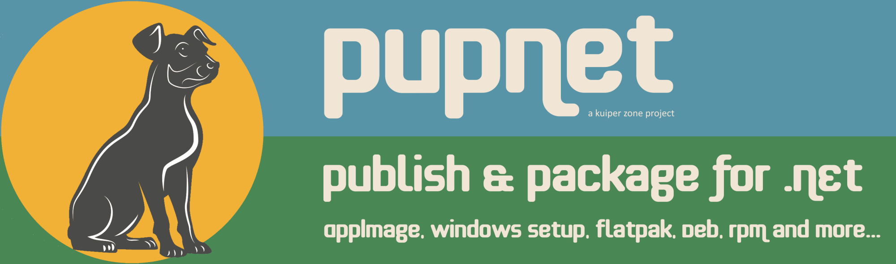

    

# Publish and Package for .NET #

## Introduction ##

### In a Sentence ... ###
**PupNet** is cross-platform deployment utility that will publish your .NET project and package the output as a
ready-to-ship installation file in a single step.

**[DOWNLOAD](https://github.com/kuiperzone/PupNet/releases/latest)**

PupNet is licensed under GNU Affero General Public License (AGPL-3.0-or-later), although this is not intend to
prevent its use in deploying commercial applications.

### More Detail ... ###
It has been possible to cross-compile command-line C# applications for sometime now. More recently, the
[Avalonia](https://github.com/AvaloniaUI/Avalonia) WPF replacement allows fully-featured GUI applications to be
built for a range of platforms, including: Linux, Windows, MacOS and Android.

**PupNet** is a command-line utility which allows you to ship your application as:

* AppImage for Linux
* Setup File for Windows
* Flatpak
* Deb Package (binary)
* RPM Package (binary)
* Plain old Zip

To use it, you fill out the parameters in a simple `pupnet.conf` file and, from within your project, run a command like so:

    pupnet -r linux-x64 -k appimage

In this case, it will call `dotnet publish` on your project and generate a distributable AppImage output file for
use on Linux systems. Additionally, you may optionally provide `.desktop` and AppStream metadata files. There is no need
to provide a complex build-specific manifest, RPM spec or Debian control file. You provide your deployment
configuration once in a single `pupnet.conf`, and PupNet takes care of the underlying build-specific tasks.

Likewise, to package the same project for Windows:

    pupnet -r win-x64 -k setup

PupNet has good support for internationalization, desktop icons, publisher metadata and custom build operations.
Although developed for .NET, it is also possible to use it to deploy C++ and other applications.

The output of PupNet is a distributable local file, such as an AppImage, flatpak or Setup.exe file -- it does
not auto-submit your project to a repository. Note also that, in order to build a Linux deployment, the build system
must be a Linux box and, likewise to build a Windows Setup file, a Windows system (hint: virtual machines are handy).

## Prerequisites ##

Install **PupNet** from the Download Page. If you are using the AppImage download, add it to your path and
consider renaming the AppImage to `pupnet`.

Out of the box, PupNet can create AppImages on Linux and Zip files on all platforms. In order to build other deployments,
you must first install the appropriate third-party builder tool against which PupNet will call.

### Flatpak on Linux ###
PupNet requires `flatpak` and `flatpak-builder`. It will also be necessary to install a flatpak platform SDK
and runtime. As appropriate:

    sudo dnf install flatpak flatpak-builder

or:

    sudo apt install flatpak flatpak-builder

And then use flatpak to install:

    sudo flatpak install flathub org.freedesktop.Platform//22.08 org.freedesktop.Sdk//22.08

Note the version number (22.08) was the latest at the time of writing, but will be subject to update.
See (Flatpak Available Runtimes)[https://docs.flatpak.org/en/latest/available-runtimes.html].

### Deb Packages on Linux ###

PupNet requires `dpkg-deb`. As appropriate:

    sudo apt install dpkg

or:

    sudo dnf install dpkg

It is possible to install `dpkg-deb` on an RPM based system in order to build Debian packages, although we
should not attempt to install such a package on the system itself (use a virtual machines to test).

### RPM Packages on Linux ###

PupNet requires `rpmbuild`. As appropriate:

    sudo dnf install rpmdevtools

or:

    sudo apt install rpm

It is possible to install `rpmbuild` on a Debian based system in order to build RPM packages, although we
should not attempt to install such a package on the system itself (use a virtual machines to test).

### Setup Files on Windows ###

PupNet leverages (InnoSetup)[https://jrsoftware.org/isinfo.php] on Windows. Download and install it.

It will also be necessary to manually add the InnoSetup location to the PATH variable so that PupNet can call the
`iscc` compiler. See below:

    

## Getting Started ##

### Build & Package the Hello World Demo ###

### Legacy Publish-AppImage ###

Pup.NET began life as "*Publish-AppImage for .NET*". It was renamed when support for Flatpaks was added.

    

See: [https://github.com/kuiperzone/Publish-AppImage](https://github.com/kuiperzone/Publish-AppImage)

### Cross-Platform GUI Development ###

You may also be interested in the [Avalonia](https://github.com/AvaloniaUI/Avalonia) framework -- the replacement for WPF.

You can now create cross-platform GUI apps using C# which run virtually any where, including
Windows, Linux, MacOS and Android. Using **PUBPAK for .NET**, you can easily deploy them on Linux
without runtime concerns.

Shown below is another cross-platform project of mine -- a cross-platform Avalonia XAML Previewer
called [AvantGarde](https://github.com/kuiperzone/AvantGarde).

    

**PUBPAK for .NET** was created by Andy Thomas at [https://kuiper.zone](https://kuiper.zone).

If you like this project, don't forget to like and share.
