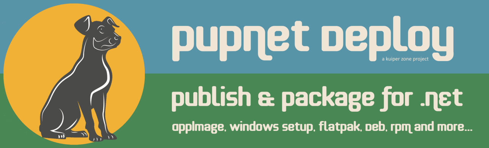
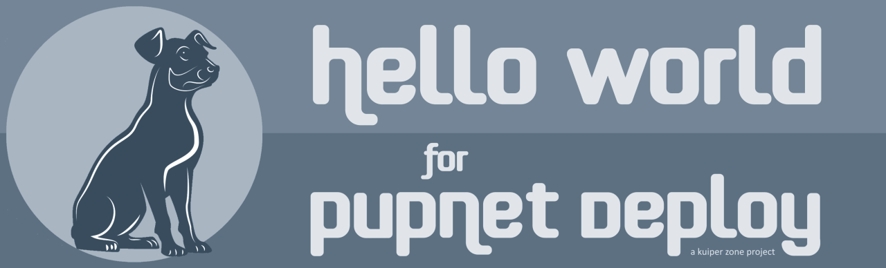
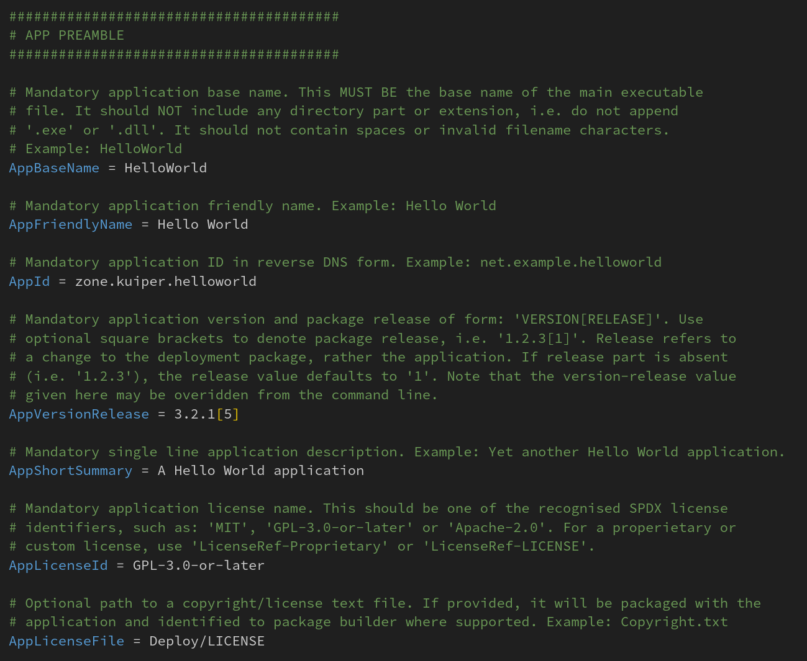
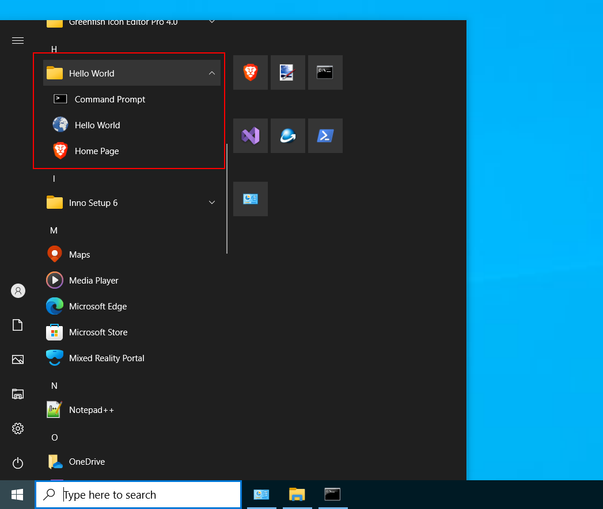
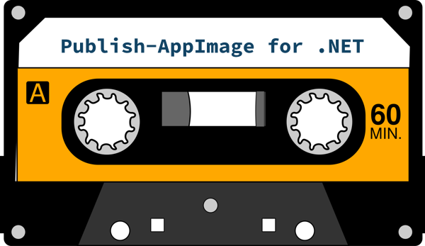

    

# PupNet Deploy - Publish & Package for .NET #

**PupNet Deploy** is a cross-platform deployment utility which packages your .NET project as a ready-to-ship
installation file in a single step.

*If you like this project, don't forget to click star and share.*

## CONTENTS ##

* [INTRODUCTION](#INTRODUCTION)

* [INSTALL & PREREQUISITES](#paragraph1)

## INTRODUCTION ##

It has been possible to cross-compile console C# applications for sometime now. More recently, the cross-platform
[Avalonia](https://github.com/AvaloniaUI/Avalonia) replacement for WPF allows fully-featured GUI applications to target
a range of platforms, including: Linux, Windows, MacOS and Android.

Now, **PupNet Deploy** allows you to ship your dotnet application as:

* AppImage for Linux
* Setup File for Windows
* Flatpak for Linux
* Debian Binary Package
* RPM Binary Package
* Plain old Zip

To create an installation file, you fill out the parameters in a simple `pupnet.conf` file and, from within your project,
run a command like so:

    pupnet --runtime linux-x64 --kind appimage

In this case, PupNet calls `dotnet publish` on your project and generates a distributable [AppImage](https://github.com/AppImage/AppImageKit)
file fo use on Linux systems. Additionally, you may optionally provide `.desktop` and AppStream metadata files.
There is no need to write complex build-specific manifests, RPM spec or Debian control files. You need only supply your
deployment configuration once as a single `pupnet.conf` file, and PupNet takes care of the underlying build-specific tasks.

Likewise, to package the same project for Windows:

    pupnet -r win-x64 -k setup

PupNet has good support for internationalization, desktop icons, publisher metadata and custom build operations.
Although developed for .NET, it is also possible to use it to deploy C++ and other kinds of applications.

The output of PupNet is a distributable file, such as an AppImage, flatpak or Windows Setup.exe file -- it does
not auto-submit your project to repositories. Note also that, in order to build a Linux deployment, the build system
must be a Linux box and, likewise to build a Windows Setup file, a Windows system (virtual machines are handy).

However, it is possible to build a Debian package on an RPM machine, and viceversa.

## INSTALL & PREREQUISITES ## 

To install as a dotnet tool:

    dotnet tool install -g KuiperZone.PupNet

Currently, the "PupNet tool" targets .NET6 LTS (this does not restrict the dotnet version of your own projects).

Alternatively, for self-contained installers:

**[DOWNLOAD & INSTALL](https://github.com/kuiperzone/PupNet/releases/latest)**

If you are using the AppImage deployment of PupNet, add it to your path and consider renaming the AppImage file to `pupnet`
so that the instructions below will match your system.

### AppImage Out of the Box ###
Out of the box, PupNet can create AppImages on Linux and Zip files on all platforms. **There is no need to install any
AppImage tools therefore.** In order to build other deployments, however, you must first install the appropriate
third-party builder tool against which PupNet will call.

### Flatpaks on Linux ###
PupNet requires `flatpak` and `flatpak-builder`. It will also be necessary to install a flatpak platform SDK and runtime.
As appropriate, use:

    sudo dnf install flatpak flatpak-builder

or:

    sudo apt install flatpak flatpak-builder

And then use flatpak to install:

    sudo flatpak install flathub org.freedesktop.Platform//22.08 org.freedesktop.Sdk//22.08

Here, the version number (22.08) was the latest at the time of writing, but will be subject to update.
See [Flatpak Available Runtimes](https://docs.flatpak.org/en/latest/available-runtimes.html).

### Deb Packages on Linux ###

PupNet requires `dpkg-deb`. So, as appropriate:

    sudo apt install dpkg

or:

    sudo dnf install dpkg

It is possible to build Debian packages using `dpkg-deb` on an RPM based system. However, it is not recommended to
test install a Debian package on an RPM machine (use a virtual machines to test it).

### RPM Packages on Linux ###

PupNet requires `rpmbuild`. As appropriate:

    sudo dnf install rpmdevtools

or:

    sudo apt install rpm

It is possible to build RPM packages using `rpmbuild` on a Debian system. However, as above, it is not recommended to
test install an RPM package on a Debian machine (use a virtual machines to test it).

### Setup Files on Windows ###

PupNet leverages [InnoSetup](https://jrsoftware.org/isinfo.php) on Windows. Download and install it.

It will also be necessary to manually add the InnoSetup location to the user's PATH variable
so that PupNet can call the `iscc` compiler. See screenshot below below:

    

## PUPNET CONFIGURATION ##

**Hello World for PupNet** is a demonstration project for PupNet Deploy. It will be instructive to discuss
the major configuration elements with reference to this simple project, as it demonstrates all the major
features of building distributable packages.

The Hello World project lives in [a separate git repo](https://github.com/kuiperzone/PupNet-HelloWorld) of its own:

    

Head over to this project in a different browser tab, or download it to your local drive.

Now, take a look at the `HelloWorld.pupnet.conf` in the root of the project.

    

This is a simple ini file in which the deployment project is configured. You will see that each parameter is documented.
Where local paths are given, they are local to the `.conf` file, rather than your current working directory.
Always use the forward-slash '/' as a path separator for cross-platform compatibility.

### Desktop File ###

Note the `DesktopFile` parameter which provides a path to a Linux `.desktop` file. *If you leave it blank, one will
be generated automatically.* In the Hello World demo, we have specified a file in order to show the contents...

Open the file `Deploy/app.desktop`, and you will see:

    [Desktop Entry]
    Type=Application
    Name=${APP_FRIENDLY_NAME}
    Icon=${APP_ID}
    Comment=${APP_SHORT_SUMMARY}
    Exec=${INSTALL_EXEC}
    TryExec=${INSTALL_EXEC}
    NoDisplay=${DESKTOP_NODISPLAY}
    X-AppImage-Integrate=${DESKTOP_INTEGRATE}
    Terminal=${DESKTOP_TERMINAL}
    Categories=${PRIME_CATEGORY}
    MimeType=
    Keywords=

Note that the contents above are entirely populated using macro variables (more below on these). However, you can
easily extend this file to specify a `MimeType` and `Keywords`, as well as adding international translations and
additional entries.

IMPORTANT: While you can edit this file as you wish, the file must contain the line below with its macro:

    Exec=${INSTALL_EXEC}

Or, if you prefer:

    Exec=${INSTALL_BIN}/app-name

The reason for this is that the actual path on installation will depend on the package type. You cannot hard code this
here as different packages will install to different paths. It is important also that you use macros as shown with
their braces, i.e. `${INSTALL_EXEC}` and not `$INSTALL_EXEC`, as a simple search-and-replace operation is
used to populate them.

In the event that you wish there be no desktop entry (i.e. a command-line application), you should declare:
`DesktopNoDisplay = true`. The file itself is ignored for Windows `Setup`, although if you set `DesktopNoDisplay`, then
no entry for your application's main executable will be added under the Windows Start Menu (i.e. synonymous
behavior on Windows with that on Linux).

**Hint:** You can use PupNet itself to generate a Linux desktop file for a new project:

    pupnet [name] --new desktop

This will create a new file for you under: `name.desktop`

### AppStream Metadata ###

The `MetaFile` parameter specifies the path to a local AppStream metadata XML file. It is optional and, if
omitted, no `.metainfo.xml` file is shipped with your application.

Take a look, for example, at the file provided under: `Deploy/app.metainfo.xml`.

Again, you will notice that macro variables are used. These are entirely optional here and simply mean, that as far
as possible, deployment configuration data is specified in one place only (i.e. your `pupnet.conf` file). However,
you may still wish to edit and extend this file to provide a screenshot, international language translations and
additional information such as keywords.

**IMPORTANT:** Since PupNet version 1.4.0, the macros `${APPSTREAM_DESCRIPTION_XML}` and `${APPSTREAM_CHANGELOG_XML}`
may be used to auto-populate the default application description, and change (release) information. These are described
in more detail below.

**Hint:** You can use PupNet itself to generate a metadata template file for a new project:

    pupnet [name] --new meta

This will create a new file for you under: `name.metainfo.xml`

### Icons ###

Multiple desktop icons are provided with the `IconPaths` parameter. You can use semi-colon as a separator, such as:
`IconPaths = icon1.ico;icon2.64x64.png;icon3.svg`, or present them in multi-line form as shown in the Hello World demo:

    IconFiles = """
        Deploy/HelloWorld.16x16.png
        Deploy/HelloWorld.24x24.png
        Deploy/HelloWorld.32x32.png
        Deploy/HelloWorld.48x48.png
        Deploy/HelloWorld.64x64.png
        Deploy/HelloWorld.svg
        Deploy/HelloWorld.ico
    """

Note the use of *triple quotes* here for multi-line values.

Use only the `svg`, `png` and `ico` file types. On Linux, `svg` and `png` files will be installed appropriately and the
Windows `ico` file ignored.

**IMPORTANT:** It is necessary to specify the size of PNG files by embedding their size in the filename, as shown, or simply as: `name.64.png`.

For Windows `Setup` packages, on the other hand, only the `ico` file is used, and PNG and SVG files are ignored.

### Dotnet Project Path ###

When building the deployment, PupNet first calls `dotnet publish` on your project. To do this, it needs to know where
your project or solution lives. In `HelloWorld.pupnet.conf`, you may note that the `DotnetProjectPath` value is empty,
however. This is because the `pupnet.conf` sits in the same directory as the `HelloWorld.sln` file.

If your `pupnet.conf` files shares the same directory as your `.sln` or `.csproj` file, you may leave `DotnetProjectPath`
empty. Otherwise use this field to specify the path to your solution or project file or directory relative to the location
of the configuration file.

### Dotnet Publish Arguments ###

The `DotnetPublishArgs` parameter is used to specify values to supply to the `dotnet publish` call:

    DotnetPublishArgs = -p:Version=${APP_VERSION} --self-contained true -p:DebugType=None -p:DebugSymbols=false

Do NOT include '-r' (runtime), or '-c' (configuration) here as they will be added automatically according to
configuration and command line arguments.

As an absolute minimum, we always want to include `--self-contained true`, as this will cause dotnet not only to
compile the application, but to publish all dependencies into a single directory. (From .NET8 onward you may wish to
consider using Native AOT as well).

### Application Versioning & Changelog ###

#### Application Version (AppVersionRelease) ####
The application version (plus release number) is specified in the `pupnet.conf` file, for example:

    AppVersionRelease = 3.2.1[5]

Here we are using the semantic version `3.2.1` plus a "package release number" in square brackets. The release number
applies specifically to the deployment package itself and is used by `rpm` and `deb` package kinds. If you omit the
release number, and just give `3.2.1` for example, it defaults to 1.

If you prefer, you can override the version in the configuration file from the command line using:

    pupnet --runtime linux-arm64 --kind deb --app-version 4.0.0[1]

Crucially, look again at the `DotnetPublishArgs` configuration value we gave above above and note `${APP_VERSION}`:

    DotnetPublishArgs = -p:Version=${APP_VERSION} --self-contained true -p:DebugType=None -p:DebugSymbols=false

Here, we can see that the version from our configuration is supplied to the build process as a variable (only the
application part is supplied, i.e. `3.2.1`). This is optional and you may remove it if you wish, although you will
then need to specify the version both in application code and the `pupnet.conf` file in this case.

#### Changelog (AppChangeFile) ####
PupNet version 1.4 introduced the `AppChangeFile` configuration property. This gives the path to a changelog file
which must use a predefined but simple format, or a README file which contains such formatted changelog information.

PupNet will parse the file and extract relevant change information. This is used to expand the `${APPSTREAM_CHANGELOG_XML}`
macro variable which may optionally be used within the `<release>` element of your AppStream metadata file. This means
that lengthy version change information need only be specified once (in a changelog or README file).

Version change information is to be provided as one or more version release sections prefixed with '+' and a leading
version number, suffixed with trailing date, with subsequent change items prefixed with '-', as follows:

    + VERSION;[Other fields ignored;]yyyy-MM-dd
    - Change feature 3
    - Change feature 4

    + VERSION;[Other fields ignored;]yyyy-MM-dd
    - Change feature 1
    - Change feature 2

Note that ';' is used as a separator. Additional fields, between the VERSION number and trailing date, may used to
ive a version title and/or maintainer contact, as below.

    + VERSION 1.3.1; Patch Release; nobody@kuiper.zone; 2023-05-01
    - Bugfix: Fix package creation when file path of contents contain spaces (enclose file path with quotes when executing chmod)

Here, the version title and contact information will be ignored and are not used in AppStream data.

It is possible for change items to span multiple lines, as follows, but a change item should not be broken with an
empty line (otherwise the parser will think it is reading plan superfluous text).

The following two examples are "legal":

    + 1.3.1;2023-05-01
    - Long change line
      describing feature 3
    - Change feature 4

    + 1.3.1;2023-05-01

    - Long change line
      describing feature 1

    - Change feature 2

The following example is "illegal" and will result in version information loss:

    + 1.3.1;2023-05-01
    - Long change line

      describing feature 1
    - Change feature 2

The changelog parser should do a robust job at parsing version information while ignoring superfluous README text,
but care should be taken to ensure that version information is correctly formatted. You may review the final AppStream
metadata (after macro expansion) by using `--verbose` command line option when building your deployment.

Finally, it should be stressed that this feature is entirely optional. If it does not suit your project, leave
`AppChangeFile` blank and specify version release information in your AppStream metadata file yourself (or just omit it).

### Terminal vs GUI Applications ###

While the Hello World demo is a terminal application, it was envisaged that a typical use case for PupNet
would be to deploy GUI applications built with Avalonia that are integrated with the desktop.

#### GUI Application ####
For a GUI application, you will want to ensure the following:

    DesktopNoDisplay = false
    DesktopTerminal = false

You may typically leave `StartCommand` empty, but may set if you wish.

#### Terminal Application ####
IMPORTANT: Your terminal application will not be in the user's path by default, so note `StartCommand` and
`SetupCommandPrompt` below. Note, also, that Flatpak is not suitable for command-line centric applications.

    DesktopNoDisplay = true
    DesktopTerminal = true
    StartCommand = command-name
    SetupCommandPrompt = Command Prompt

(You may wish, however, to provide a desktop entry for your terminal app by setting `DesktopNoDisplay` to false.)

With `StartCommand`, you should set a simple command name for application which will be located in the path. This will be
realized via a tiny bash script on Linux, or bat file on Windows, which will launch your main application. If, for example,
your runnable file is something like 'Zone.Kuiper.HelloWorld', you may set `StartCommand` simply to 'helloworld'.

On Windows, a different application is taken. The `SetupCommandPrompt` is a Windows only option which ensures that a
Console entry is written to the Program Files menu (using the title you supply) which, when launched, will open a
dedicated command window with your application directory in the user path.

### Custom Post-Publish Operations ###

In `HelloWorld.pupnet.conf`, we see the lines:

    DotnetPostPublish = Deploy/PostPublish.sh
    DotnetPostPublishOnWindows = Deploy/PostPublish.bat

This is an advanced feature which allows you to call a command or script in order to perform additional operations after
`dotnet publish` has been called, but prior to building the package output. The above commands are called only on their
respective build systems, and should perform equivalent operation.

Such scripts may employ macro variables which are exported to the environment. The Hello World bash and batch scripts above,
for example, create a subdirectory and dummy file within the application build directory, the path of which is supplied
as the `${BUILD_APP_BIN}` environment variable (see below for a complete reference).

Here are the contents of our example bash script:

    #!/bin/bash
    # This is a dummy bash script used for demonstration and test. It outputs a few variables
    # and creates a dummy file in the application directory which will be detected by the program.

    echo
    echo "==========================="
    echo "POST_PUBLISH BASH SCRIPT"
    echo "==========================="
    echo

    # Some useful macros / environment variables
    echo "BUILD_ARCH: ${BUILD_ARCH}"
    echo "BUILD_TARGET: ${BUILD_TARGET}"
    echo "BUILD_SHARE: ${BUILD_SHARE}"
    echo "BUILD_APP_BIN: ${BUILD_APP_BIN}"
    echo

    # Directory and file will be detected by HelloWorld Program
    echo "Do work..."
    set -x #echo on
    mkdir -p "${BUILD_APP_BIN}/subdir"
    touch "${BUILD_APP_BIN}/subdir/file.test"
    set +x #echo off

    echo
    echo "==========================="
    echo "POST_PUBLISH END"
    echo "==========================="
    echo

Likewise, in the Hello World demo bat file which does the equivalent job on Windows.

#### Non-Dotnet Projects ####

Additionally, you may leverage the post-publish operations (above) to perform the actual build operation itself
and populate the `${BUILD_APP_BIN}` directory with the output of your build process -- whatever that may be. In
principle, therefore, you could use this to package a C++ or Python application, provided that it is satisfactory
that the application and all its associated libraries are contained in a single target directory.

IMPORTANT: If you do this, you will need to disable PupNet from calling `dotnet publish`, which can be done by setting
`DotnetProjectPath = NONE`.

### Debian and RPM Considerations ###

#### Install Location ####
With Debian and RPM deployments, your application will be installed to the `/opt` directory, rather than `/usr/bin`.
If you set `StartCommand`, a tiny bash script will also be installed to `/usr/bin` in order to launch your application.

#### Dependencies ####
Although publishing a "self-contained" dotnet app should ideally produce a truly *self-contained* package, in reality
it may have additional dependencies which create complexity when building RPM and Debian deployments.

Microsoft list additional dependencies for these, although note that they may also be distro specific also:
https://learn.microsoft.com/en-us/dotnet/core/install/linux-scripted-manual#rpm-dependencies

From PupNet version 1.3.0 onward, the pupnet.conf file supports the ability to define such additional dependencies
using the `RpmRequires` and `DebRecommends` properties. By default, they are populated with typically expected values
(below), although these may be subject to change and you should review them for you application.

    RpmRequires = """
        krb5-libs
        libicu
        openssl-libs
        zlib
    """

    DebianRecommends = """
        libc6
        libgcc1
        libgcc-s1
        libgssapi-krb5-2
        libicu
        libssl
        libstdc++6
        libunwind
        zlib1g
    """

*You should test RPM and Debian packages against your target distributions.*

## BUILDING THE HELLO WORLD DEMO ##

**Hello World for PupNet** can be built for all package kinds, including `appimage`, `flatpak`, `deb`, `rpm`, `zip`
and `setup` for Windows.

If you wish to build and try the demo, clone or download the [PupNet Hello World Project](https://github.com/kuiperzone/PupNet-HelloWorld)
to your local drive. Ensure that you have installed the prerequisites above, or at least those you wish to use.

In the terminal, CD into the root of the project directory.

### On Linux ###

Assuming you're on Linux, type:

    pupnet --kind appimage

This will show the following information and ask for confirmation before building the deployment file.

    ============================================================
    APPLICATION: HelloWorld 1.0.3 [1]
    ============================================================

    AppBaseName: HelloWorld
    AppId: zone.kuiper.helloworld
    AppVersion: 1.0.3
    PackageRelease: 1
    StartCommand: helloworld [Not Supported]

    ============================================================
    OUTPUT: APPIMAGE
    ============================================================

    PackageKind: AppImage
    Runtime: linux-x64
    Arch: Auto (x86_64)
    Build: Release
    OutputName: HelloWorld.x86_64.AppImage
    OutputDirectory: /mnt/DEVEL-1T/DOTNET/GITHUB/PupNet-HelloWorld/Deploy/bin

    ============================================================
    DESKTOP: app.desktop
    ============================================================

    [Desktop Entry]
    Type=Application
    Name=Hello World
    Icon=zone.kuiper.helloworld
    Comment=A Hello World application
    Exec=usr/bin/HelloWorld
    TryExec=usr/bin/HelloWorld
    NoDisplay=false
    X-AppImage-Integrate=true
    Terminal=true
    Categories=Utility
    MimeType=
    Keywords=

    ============================================================
    CHANGELOG: CHANGES
    ============================================================

    + Version 1.0.3;2023-05-04
    - The pupnet.conf file upgraded to version 1.4.0
    - Added ${APPSTREAM_CHANGELOG_XML} to app.metainfo.xml
    - Added ${APPSTREAM_DESCRIPTION_XML} to app.metainfo.xml
    - Other minor corrections and changes
    - This line is deliberate test of escaping XML <>/" characters

    + Version 1.0.2;2023-04-18
    - The pupnet.conf file upgraded to version 1.3.0
    - Now builds using .NET6, rather than .NET7 (you can change this in csproj file if needed)
    - Reinstated key-press to exit on all deployments

    + Version 1.0.1;2023-03-26
    - Programs now asks for key-press only on Windows
    - Reports version correctly as 1.0.1

    + Version 1.0.0;2023-03-22
    - Initial release
    - Reports version as "3.2.1". This was intentional at the time by way of demonstration.

    ============================================================
    BUILD PROJECT: PupNet-HelloWorld
    ============================================================

    dotnet publish "/mnt/DEVEL-1T/DOTNET/GITHUB/PupNet-HelloWorld" -r linux-x64 -c Release -p:Version=1.0.3 --self-contained true -p:DebugType=None -p:DebugSymbols=false -o "/tmp/KuiperZone.PupNet/zone.kuiper.helloworld-linux-x64-Release-AppImage/AppDir/usr/bin"

    /mnt/DEVEL-1T/DOTNET/GITHUB/PupNet-HelloWorld/Deploy/PostPublish.sh

    ============================================================
    BUILD PACKAGE: HelloWorld.x86_64.AppImage
    ============================================================

    /tmp/.mount_PupNetPJRwcO/usr/bin/appimagetool-x86_64.AppImage  --runtime-file="/tmp/.mount_PupNetPJRwcO/usr/bin/runtime-x86_64" "/tmp/KuiperZone.PupNet/zone.kuiper.helloworld-linux-x64-Release-AppImage/AppDir" "/mnt/DEVEL-1T/DOTNET/GITHUB/PupNet-HelloWorld/Deploy/bin/HelloWorld.x86_64.AppImage"

    ============================================================
    ISSUES
    ============================================================

    NONE

    Continue? [N/y]:

This tells us that it will create a file called `HelloWorld.x86_64.AppImage`, under the `Deploy/bin` directory.
Moreover, it shows the expanded contents of the desktop file, and gives the `dotnet publish` call it will make so
that we may ensure that everything looks correct before hitting "y".

We can view more information, including the AppStream metadata contents, by using:

    pupnet --kind appimage --verbose

The `--verbose` option is useful in other areas too, as we will see below.

### On Windows ###

On a Windows machine with InnoSetup installed, type:

    pupnet --kind setup

This will generate the file: `HelloWorld.x64.exe`, which may be launched to install the program.

    

On installation, we find we have a new Program Menu entry, as shown below. We can see that it has also
included a link to our home page, which is optional.

    

Moreover, there is a "Command Prompt" option to launch a dedicated command window, as described above.

## CREATING NEW PUPNET PROJECT FILES ##

If you're starting a new project, you will wish to generate a new `pupnet.conf` file and possibly the associated
desktop and AppStream metadata files as well.

To generate a new `pupnet.conf` file in the current working directory:

    pupnet --new conf

This will create a new file, `app.pupnet.conf`, which will be a "light weight" configuration file lacking the
documentation comments.

To generate a "verbose" file with documentation under a custom name:

    pupnet ProjectName --new conf --verbose

In fact, we can generate a complete set of files, as follows:

    pupnet ProjectName --new all --verbose

This creates not only the `pupnet.conf` file, but the `.desktop` and a `.metainfo.xml` template as well.

## BACKWARD COMPATIBILITY & UPGRADING YOUR CONFIGURATION ##
Where possible, new versions of PupNet will be backward compatible with existing pupnet.conf files. If ever this
is not the case, it will be explicitly stated.

New configuration properties may be added and old ones removed or deprecated. Where a new PupNet version results in
changes to configuration properties, you can upgrade an existing pupnet.conf file to the latest format using:

    pupnet [file.pupnet.conf] --upgrade-conf

or

    pupnet [file.pupnet.conf] --upgrade-conf --verbose

Your existing file will "backed-up" by appending an ".old" extension, and a new file written containing new properties
with their default values.

Using the --verbose option (above), causes the new file to contain extensive document comments. Without it, the new file
will be stripped of comments.

See also version specific changes below.

### Version 1.4 Changes ###

PupNet version 1.4 introduced new `AppDescription` and `AppChangeFile` configuration properties. If you wish to
make use of them, populate `AppDescription` with a longer application description (example below), and point `AppChangeFile`
to a changelog or README file containing formatted version information.

    AppDescription = """
        Hello World demonstrates all the major features of building distributable packages with PupNet.
        It can be built for all package kinds, including AppImage, Flatpak, DEB and RPM formats on Linux,
        and as a Setup file on Windows. It provides an example of using desktop and AppStream metadata files,
        as well as icons and post-publish scripts.

        On execution, the Hello World program displays command arguments and assembly information. The assembly
        version confirms that version information, provided in the deployment configuration, was successfully passed
        through the build system, to the application.
    """

    AppChangeFile = CHANGES.txt

See above for the required format of `AppChangeFile` content.

Additionally, you will need to add a couple of macros to your AppStream metadata file, as follows, in order to fully
make use of these new features:

    <description>
        ${APPSTREAM_DESCRIPTION_XML}
    </description>

Here, you may replace your default description text, but keep any other language text.

    <releases>
        ${APPSTREAM_CHANGELOG_XML}
    </releases>

With this, you should remove existing version release information.

In addition to AppStream metadata, the `AppDescription` content is also now used in the construction of RPM and DEB
packages.

## HELP SYSTEM REFERENCE ##

### Command Arguments ###

Type `pupnet --help` to display command arguments as expected.

    PupNet Deploy 1.4.0
    See also: https://github.com/kuiperzone/PupNet-Deploy

    USAGE:
    pupnet [<file.pupnet.conf>] [--option-n value-n]

    Example:
    pupnet app..pupnet.conf -y -r linux-arm64

    Always give .pupnet.conf file first. If .pupnet.conf file is omitted, the default is the one in the working directory.

    Build Options:
    -k, --kind <Zip|AppImage|Deb|Rpm|Flatpak|Setup>
    Package output kind. If omitted, one is chosen according to the runtime (AppImage on linux).
    Example: pupnet HelloWorld -k Flatpak

    -r, --runtime <linux-x64|linux-arm64|win-x64...>
    Dotnet publish runtime identifier. Default: linux-x64.
    Valid examples include: 'linux-x64', 'linux-arm64' and 'win-x64' etc.
    See: https://docs.microsoft.com/en-us/dotnet/core/rid-catalog

    -c, --build <Release|Debug>
    Optional build target (or 'Configuration' in dotnet terminology).
    Value should be 'Release' or 'Debug' only. Default: Release.

    -e, --clean
    Call 'dotnet clean' prior to 'dotnet publish'. Default: false.

    -v, --app-version <version[release]>
    Specifies application version-release in form 'version[release]', where value in square
    brackets is package release. Overrides AppVersionRelease in conf file.
    Example: 1.2.3[1].

    -p, --property <name=value>
    Specifies a property to be supplied to dotnet publish command. Do not use for app versioning.
    Example: -p DefineConstants=TRACE;DEBUG

    --arch value
    Force target architecture, i.e. as 'x86_64', 'amd64' or 'aarch64' etc. Note that this is
    not normally necessary as, in most cases, the architecture is defined by the dotnet runtime-id
    and will be successfully detected automatically. However, in the event of a problem, the value
    explicitly supplied here will be used to override. It should be provided in the form
    expected by the underlying package builder (i.e. rpmbuild, appimagetool or InnoSetup etc.).

    -o, --output <filename>
    Force package output filename. Normally this is derived from parameters in the configuration.
    This value will be used to override. Example: -o AppName.AppImage

    --verbose
    Indicates verbose output when building. It is used also with --new option.

    -u, --run
    Performs a test run of the application after successful build (where supported).

    -y, --skip-yes
    Skips confirmation prompts (assumes yes).

    Other Options:

    -n, --new <conf|desktop|meta|all> [--verbose] [--skip-yes]
    Creates a new empty conf file or associated file (i.e. desktop of metadata) for a new project.
    A base file name may optionally be given. If --verbose is used, a configuration file with
    documentation comments is generated. Use 'all' to generate a full set of configuration assets.
    Example: pupnet HelloWorld -n all --verbose

    --upgrade-conf [--verbose] [--skip-yes]
    Upgrades supplied .pupnet.conf file to latest version parameters. For example, if the
    conf file was created with program version 1.1 and new parameters where added in version
    1.2, this command will upgrade the file by adding new parameters with default values.
    If --verbose is used, a configuration file with documentation comments is generated.
    Example: pupnet file.pupnet.conf --upgrade-conf --verbose

    -h, --help <args|macro|conf>
    Show help information. Optional value specifies what kind of information to display.
    Default is 'args'. Example: pupnet -h macro

    --version
    Show version and associated information.

### Macro Reference ###

Type `pupnet --help macro` to see supported macro reference information:

    Macro variables may be used with the following configuration items:
    DesktopFile, MetaFile, DotnetPublishArgs, DotnetPostPublish and DotnetPostPublishOnWindows.

    IMPORTANT: Always use the ${MACRO_NAME} form, and not $MACRO_NAME.

    ** ${APP_BASE_NAME} **
    Gives the AppBaseName value from the pupnet.conf file
    Example: ${APP_BASE_NAME} = HelloWorld

    ** ${APP_FRIENDLY_NAME} **
    Gives the AppFriendlyName value from the pupnet.conf file
    Example: ${APP_FRIENDLY_NAME} = Hello World

    ** ${APP_ID} **
    Gives the AppId value from the pupnet.conf file
    Example: ${APP_ID} = net.example.helloworld

    ** ${APP_LICENSE_ID} **
    Gives the AppLicenseId value from the pupnet.conf file
    Example: ${APP_LICENSE_ID} = LicenseRef-Proprietary

    ** ${APP_SHORT_SUMMARY} **
    Gives the AppShortSummary value from the pupnet.conf file
    Example: ${APP_SHORT_SUMMARY} = A HelloWorld application

    ** ${APP_VERSION} **
    Application version, excluding package-release extension
    Example: ${APP_VERSION} = 1.0.0

    ** ${APPSTREAM_CHANGELOG_XML} **
    AppStream changelog XML content (use within the <releases> element only)

    ** ${APPSTREAM_DESCRIPTION_XML} **
    AppStream application description XML (use within the <description> element only)

    ** ${BUILD_APP_BIN} **
    Application build directory (i.e. the output of dotnet publish or C++ make)
    Example: ${BUILD_APP_BIN} = /tmp/KuiperZone.PupNet/net.example.helloworld-linux-x64-Release-AppImage/AppDir/usr/bin

    ** ${BUILD_ARCH} **
    Build architecture: x64, arm64, arm or x86 (may differ from package output notation)
    Example: ${BUILD_ARCH} = x64

    ** ${BUILD_DATE} **
    Build date in 'yyyy-MM-dd' format
    Example: ${BUILD_DATE} = 2023-05-05

    ** ${BUILD_ROOT} **
    Root of the temporary application build directory
    Example: ${BUILD_ROOT} = /tmp/KuiperZone.PupNet/net.example.helloworld-linux-x64-Release-AppImage/AppDir

    ** ${BUILD_SHARE} **
    Linux 'usr/share' build directory under BuildRoot (empty for some deployments)
    Example: ${BUILD_SHARE} = /tmp/KuiperZone.PupNet/net.example.helloworld-linux-x64-Release-AppImage/AppDir/usr/share

    ** ${BUILD_TARGET} **
    Release or Debug (Release unless explicitly specified)
    Example: ${BUILD_TARGET} = Release

    ** ${BUILD_YEAR} **
    Build year as 'yyyy'
    Example: ${BUILD_YEAR} = 2023

    ** ${DEPLOY_KIND} **
    Deployment output kind: appimage, flatpak, rpm, deb, setup, zip
    Example: ${DEPLOY_KIND} = appimage

    ** ${DESKTOP_INTEGRATE} **
    Gives the logical not of ${DESKTOP_NODISPLAY}
    Example: ${DESKTOP_INTEGRATE} = true

    ** ${DESKTOP_NODISPLAY} **
    Gives the DesktopNoDisplay value from the pupnet.conf file
    Example: ${DESKTOP_NODISPLAY} = false

    ** ${DESKTOP_TERMINAL} **
    Gives the DesktopTerminal value from the pupnet.conf file
    Example: ${DESKTOP_TERMINAL} = true

    ** ${DOTNET_RUNTIME} **
    Dotnet publish runtime identifier used (RID)
    Example: ${DOTNET_RUNTIME} = linux-x64

    ** ${INSTALL_BIN} **
    Path to application directory on target system (not the build system)
    Example: ${INSTALL_BIN} = usr/bin

    ** ${INSTALL_EXEC} **
    Path to application executable on target system (not the build system)
    Example: ${INSTALL_EXEC} = usr/bin/HelloWorld

    ** ${LOCAL_DIRECTORY} **
    The pupnet.conf file directory

    ** ${PACKAGE_RELEASE} **
    Package release version
    Example: ${PACKAGE_RELEASE} = 1

    ** ${PRIME_CATEGORY} **
    Gives the PrimeCategory value from the pupnet.conf file
    Example: ${PRIME_CATEGORY} = Utility

    ** ${PUBLISHER_COPYRIGHT} **
    Gives the PublisherCopyright value from the pupnet.conf file
    Example: ${PUBLISHER_COPYRIGHT} = Copyright (C) Acme Ltd 2023

    ** ${PUBLISHER_EMAIL} **
    Gives the PublisherEmail value from the pupnet.conf file
    Example: ${PUBLISHER_EMAIL} = contact@example.net

    ** ${PUBLISHER_LINK_NAME} **
    Gives the PublisherLinkName value from the pupnet.conf file
    Example: ${PUBLISHER_LINK_NAME} = Project Page

    ** ${PUBLISHER_LINK_URL} **
    Gives the PublisherLinkUrl value from the pupnet.conf file
    Example: ${PUBLISHER_LINK_URL} = https://example.net

    ** ${PUBLISHER_NAME} **
    Gives the PublisherName value from the pupnet.conf file
    Example: ${PUBLISHER_NAME} = The Hello World Team

### Configuration Reference ###

Type `pupnet --help conf` to see supported configuration reference information:

    ** AppBaseName **
    Mandatory application base name. This MUST BE the base name of the main executable file. It should NOT
    include any directory part or extension, i.e. do not append '.exe' or '.dll'. It should not contain
    spaces or invalid filename characters.
    Example: AppBaseName = HelloWorld

    ** AppFriendlyName **
    Mandatory application friendly name.
    Example: AppFriendlyName = Hello World

    ** AppId **
    Mandatory application ID in reverse DNS form. This should stay constant for lifetime of the software.
    Example: AppId = net.example.helloworld

    ** AppVersionRelease **
    Mandatory application version and package release of form: 'VERSION[RELEASE]'. Use optional square
    brackets to denote package release, i.e. '1.2.3[1]'. Release refers to a change to the deployment
    package, rather the application. If release part is absent (i.e. '1.2.3'), the release value defaults
    to '1'. Note that the version-release value given here may be overridden from the command line.
    Example: AppVersionRelease = 1.0.0[1]

    ** AppShortSummary **
    Mandatory single line application short summary description.
    Example: AppShortSummary = A HelloWorld application

    ** AppDescription **
    Optional multi-line (surround with triple """ quotes) application description which may provide
    longer text than AppShortSummary. Text separated by an empty line will be treated as paragraphs
    (complex formatting should be avoided). The content is used by package builders where supported,
    including RPM and DEB, and may optionally be used to populate the '<description>' element in the
    AppStream metadata through the use of a macro variable.

    ** AppLicenseId **
    Mandatory application license ID. This should be one of the recognized SPDX license
    identifiers, such as: 'MIT', 'GPL-3.0-or-later' or 'Apache-2.0'. For a proprietary or
    custom license, use 'LicenseRef-Proprietary' or 'LicenseRef-LICENSE'.
    Example: AppLicenseId = LicenseRef-Proprietary

    ** AppLicenseFile **
    Optional path to application copyright/license text file. If provided, it will be packaged with the
    application and used with package builders where supported.
    Example: AppLicenseFile = LICENSE.txt

    ** AppChangeFile **
    Optional path to application changelog file. IMPORTANT. If given, this file should contain version
    information in a predefined format. Namely, it should contain one or more version headings of form:
    '+ VERSION;DATE', under which are to be listed change items of form: '- Change description'. Formatted
    information will be parsed and used to populate AppStream metadata. Additionally, it will be packaged
    with the application and used with package builders where supported. NOTE. Superfluous text in the file
    is ignored, so the file may also contain README information.
    For information: https://github.com/kuiperzone/PupNet-Deploy.
    Example: AppChangeFile = CHANGELOG.txt

    ########################################
    # PUBLISHER
    ########################################

    ** PublisherName **
    Mandatory publisher, group or creator.
    Example: PublisherName = The Hello World Team

    ** PublisherCopyright **
    Optional copyright statement.
    Example: PublisherCopyright = Copyright (C) Acme Ltd 2023

    ** PublisherLinkName **
    Optional publisher or application web-link name. Note that Windows Setup packages
    require both PublisherLinkName and PublisherLinkUrl in order to include the link as
    an item in program menu entries. Do not modify name, as may leave old entries in updated installations.
    Example: PublisherLinkName = Project Page

    ** PublisherLinkUrl **
    Optional publisher or application web-link URL.
    Example: PublisherLinkUrl = https://example.net

    ** PublisherEmail **
    Publisher or maintainer email contact. Although optional, some package builders (i.e. DEB) require it
    and may warn or fail unless provided.
    Example: PublisherEmail = contact@example.net

    ########################################
    # DESKTOP INTEGRATION
    ########################################

    ** DesktopNoDisplay **
    Boolean (true or false) which indicates whether the application is hidden on the desktop. It is used to
    populate the 'NoDisplay' field of the .desktop file. The default is false. Setting to true will also
    cause the main application start menu entry to be omitted for Windows Setup.
    Example: DesktopNoDisplay = false

    ** DesktopTerminal **
    Boolean (true or false) which indicates whether the application runs in the terminal, rather than
    providing a GUI. It is used to populate the 'Terminal' field of the .desktop file.
    Example: DesktopTerminal = true

    ** DesktopFile **
    Optional path to a Linux desktop file. If empty (default), one will be generated automatically from
    the information in this file. Supplying a custom file, however, allows for mime-types and
    internationalisation. If supplied, the file MUST contain the line: 'Exec=${INSTALL_EXEC}'
    in order to use the correct install location. Other macros may be used to help automate the content.
    Note. PupNet Deploy can generate you a desktop file. Use --help and 'pupnet --help macro' for reference.
    See: https://specifications.freedesktop.org/desktop-entry-spec/desktop-entry-spec-latest.html
    Example: DesktopFile = Deploy/app.desktop

    ** StartCommand **
    Optional command name to start the application from the terminal. If, for example, AppBaseName is
    'Zone.Kuiper.HelloWorld', the value here may be set to a simpler and/or lower-case variant such as
    'helloworld'. It must not contain spaces or invalid filename characters. Do not add any extension such
    as '.exe'. If empty, the application will not be in the path and cannot be started from the command line.
    For Windows Setup packages, see also SetupCommandPrompt. StartCommand is not
    supported for all packages kinds (i.e. Flatpak). Default is empty (none).
    Example: StartCommand = helloworld

    ** PrimeCategory **
    Optional category for the application. The value should be one of the recognized Freedesktop top-level
    categories, such as: Audio, Development, Game, Office, Utility etc. Only a single value should be
    provided here which will be used, where supported, to populate metadata. The default is empty.
    See: https://specifications.freedesktop.org/menu-spec/latest/apa.html
    Example: PrimeCategory = Utility

    ** MetaFile **
    Path to AppStream metadata file. It is optional, but recommended as it is used by software centers.
    Note. The contents of the files may use macro variables. Use 'pupnet --help macro' for reference.
    See: https://docs.appimage.org/packaging-guide/optional/appstream.html
    Example: MetaFile = Deploy/app.metainfo.xml

    ** IconFiles **
    Optional icon file paths. The value may include multiple filenames separated with semicolon or given
    in multi-line form. Valid types are SVG, PNG and ICO (ICO ignored on Linux). Note that the inclusion
    of a scalable SVG is preferable on Linux, whereas PNGs must be one of the standard sizes and MUST
    include the size in the filename in the form: name.32x32.png' or 'name.32.png'.
    Example: IconFiles = """
        app.ico
        app.svg
        app.16x16.png
        app.32x32.png
        app.64x64.png
    """

    ########################################
    # DOTNET PUBLISH
    ########################################

    ** DotnetProjectPath **
    Optional path relative to this file in which to find the dotnet project (.csproj) or solution (.sln)
    file, or the directory containing it. If empty (default), a single project or solution file is
    expected under the same directory as this file. IMPORTANT. If set to 'NONE', dotnet publish
    is disabled (not called). Instead, only DotnetPostPublish is called.
    Example: DotnetProjectPath = Source

    ** DotnetPublishArgs **
    Optional arguments supplied to 'dotnet publish'. Do NOT include '-r' (runtime), or '-c' (configuration)
    here as they will be added according to command line arguments. Typically you want as a minimum:
    '-p:Version=${APP_VERSION} --self-contained true'. Additional useful arguments include:
    '-p:DebugType=None -p:DebugSymbols=false -p:PublishSingleFile=true -p:PublishReadyToRun=true
    -p:PublishTrimmed=true -p:TrimMode=link'. Note. This value may use macro variables. Use 'pupnet --help macro'
    for reference. See: https://docs.microsoft.com/en-us/dotnet/core/tools/dotnet-publish
    Example: DotnetPublishArgs = -p:Version=${APP_VERSION} --self-contained true -p:DebugType=None -p:DebugSymbols=false

    ** DotnetPostPublish **
    Post-publish (or standalone build) command on Linux (ignored on Windows). It is called after dotnet
    publish, but before the final output is built. This could, for example, be a script which copies
    additional files into the build directory given by ${BUILD_APP_BIN}. The working directory will be
    the location of this file. This value is optional, but becomes mandatory if DotnetProjectPath equals
    'NONE'. Note. This value may use macro variables. Additionally, scripts may use these as environment
    variables. Use 'pupnet --help macro' for reference.
    Example: DotnetPostPublish = post-publish.sh

    ** DotnetPostPublishOnWindows **
    Post-publish (or standalone build) command on Windows (ignored on Linux). This should perform
    the equivalent operation, as required, as DotnetPostPublish, but using DOS commands and batch
    scripts. Multiple commands may be specified, separated by semicolon or given in multi-line form.
    Note. This value may use macro variables. Additionally, scripts may use these as environment
    variables. Use 'pupnet --help macro' for reference.
    Example: DotnetPostPublishOnWindows = post-publish.bat

    ########################################
    # PACKAGE OUTPUT
    ########################################

    ** PackageName **
    Optional package name (excludes version etc.). If empty, defaults to AppBaseName. However, it is
    used not only to specify the base output filename, but to identify the application in DEB and RPM
    packages. You may wish, therefore, to ensure that the value represents a unique name. Naming
    requirements are strict and must contain only alpha-numeric and '-', '+' and '.' characters.
    Example: PackageName = HelloWorld

    ** OutputDirectory **
    Output directory, or subdirectory relative to this file. It will be created if it does not exist and
    will contain the final deploy output files. If empty, it defaults to the location of this file.
    Example: OutputDirectory = Deploy/OUT

    ########################################
    # APPIMAGE OPTIONS
    ########################################

    ** AppImageArgs **
    Additional arguments for use with appimagetool. Useful for signing. Default is empty.
    Example: AppImageArgs = --sign

    ** AppImageVersionOutput **
    Boolean (true or false) which sets whether to include the application version in the AppImage filename,
    i.e. 'HelloWorld-1.2.3-x86_64.AppImage'. Default is false. It is ignored if the output filename is
    specified at command line.
    Example: AppImageVersionOutput = false

    ########################################
    # FLATPAK OPTIONS
    ########################################

    ** FlatpakPlatformRuntime **
    The runtime platform. Invariably for .NET (inc. Avalonia), this should be 'org.freedesktop.Platform'.
    Refer: https://docs.flatpak.org/en/latest/available-runtimes.html
    Example: FlatpakPlatformRuntime = org.freedesktop.Platform

    ** FlatpakPlatformSdk **
    The platform SDK. Invariably for .NET (inc. Avalonia applications) this should be 'org.freedesktop.Sdk'.
    The SDK must be installed on the build system.
    Example: FlatpakPlatformSdk = org.freedesktop.Sdk

    ** FlatpakPlatformVersion **
    The platform runtime version. The latest available version may change periodically.
    Refer to Flatpak documentation.
    Example: FlatpakPlatformVersion = 22.08

    ** FlatpakFinishArgs **
    Flatpak manifest 'finish-args' sandbox permissions. Optional, but if empty, the application will have
    extremely limited access to the host environment. This option may be used to grant required
    application permissions. Values here should be prefixed with '--' and separated by semicolon or given
    in multi-line form. Refer: https://docs.flatpak.org/en/latest/sandbox-permissions.html
    Example: FlatpakFinishArgs = """
        --socket=wayland
        --socket=x11
        --filesystem=host
        --share=network
    """

    ** FlatpakBuilderArgs **
    Additional arguments for use with flatpak-builder. Useful for signing. Default is empty.
    See flatpak-builder --help.
    Example: FlatpakBuilderArgs = --gpg-keys=FILE

    ########################################
    # RPM OPTIONS
    ########################################

    ** RpmAutoReq **
    Boolean (true or false) which specifies whether to build the RPM package with 'AutoReq' equal to yes or no.
    For dotnet application, the value should typically be false, but see RpmRequires below.
    Refer: https://rpm-software-management.github.io/rpm/manual/spec.html
    Example: RpmAutoReq = false

    ** RpmAutoProv **
    Boolean (true or false) which specifies whether to build the RPM package with 'AutoProv' equal to yes or no.
    Refer: https://rpm-software-management.github.io/rpm/manual/spec.html
    Example: RpmAutoProv = true

    ** RpmRequires **
    Optional list of RPM dependencies. The list may include multiple values separated with semicolon or given
    in multi-line form. If empty, a self-contained dotnet package will successfully run on many (but not all)
    Linux distros. In some cases, it will be necessary to explicitly specify additional dependencies.
    Default values are recommended for use with dotnet and RPM packages at the time of writing.
    For updated information, see: https://learn.microsoft.com/en-us/dotnet/core/install/linux-rhel#dependencies
    Example: RpmRequires = """
        krb5-libs
        libicu
        openssl-libs
        zlib
    """

    ########################################
    # DEBIAN OPTIONS
    ########################################

    ** DebianRecommends **
    Optional list of Debian dependencies. The list may include multiple values separated with semicolon or given
    in multi-line form. If empty, a self-contained dotnet package will successfully run on many (but not all)
    Linux distros. In some cases, it will be necessary to explicitly specify additional dependencies.
    Default values are recommended for use with dotnet and Debian packages at the time of writing.
    For updated information, see: https://learn.microsoft.com/en-us/dotnet/core/install/linux-ubuntu#dependencies
    Example: DebianRecommends = """
        libc6
        libgcc1
        libgcc-s1
        libgssapi-krb5-2
        libicu
        libssl
        libstdc++6
        libunwind
        zlib1g
    """

    ########################################
    # WINDOWS SETUP OPTIONS
    ########################################

    ** SetupAdminInstall **
    Boolean (true or false) which specifies whether the application is to be installed in administrative
    mode, or per-user. Default is false. See: https://jrsoftware.org/ishelp/topic_admininstallmode.htm
    Example: SetupAdminInstall = false

    ** SetupCommandPrompt **
    Optional command prompt title. The Windows installer will NOT add your application to the path. However,
    if your package contains a command-line utility, setting this value will ensure that a 'Command Prompt'
    program menu entry is added (with this title) which, when launched, will open a dedicated command
    window with your application directory in its path. Default is empty. See also StartCommand.
    Example: SetupCommandPrompt = Command Prompt

    ** SetupMinWindowsVersion **
    Mandatory value which specifies minimum version of Windows that your software runs on. Windows 8 = 6.2,
    Windows 10/11 = 10. Default: 10. See: https://jrsoftware.org/ishelp/topic_setup_minversion.htm
    Example: SetupMinWindowsVersion = 10

    ** SetupSignTool **
    Optional name and parameters of the Sign Tool to be used to digitally sign: the installer,
    uninstaller, and contained exe and dll files. If empty, files will not be signed.
    See: https://jrsoftware.org/ishelp/topic_setup_signtool.htm

    ** SetupSuffixOutput **
    Optional suffix for the installer output filename. The default is empty, but you may wish set it to:
    'Setup' or similar. This, for example, will output a file of name: HelloWorldSetup-x86_64.exe
    Ignored if the output filename is specified at command line.
    Example: SetupSuffixOutput = Setup

    ** SetupVersionOutput **
    Boolean (true or false) which sets whether to include the application version in the setup filename,
    i.e. 'HelloWorld-1.2.3-x86_64.exe'. Default is false. Ignored if the output filename is specified
    at command line.
    Example: SetupVersionOutput = true

## FAQs & GOTCHAS ##

### Virtual Box and Symlinks ###
If you are using VirtualBox with your project, note that symbolic links are disabled within shared folders by VirtualBox
itself, and this may cause problems with generating AppImages. To overcome this, copy your entire project to your home
directory in the virtual machine. Alternatively, it is possible to enable shared-folder symlinks in VirtualBox.

### RPM Outputs to a Subdirectory ###
The RPM package builder creates subdirectories under the directory that you specify. This is normal
behaviour and cannot be overridden.

### Package Naming Convention is not Consistent ###
You may notice that PupNet outputs differences in package naming styles. For example:

    PupNet-Deploy.x86_64.AppImage
    pupnet-deploy_0.0.1-1_amd64.deb

PupNet follows the naming conventions used with the respective packages. This includes different CPU architecture
naming conventions.

### RPM and Debian Packages Cannot be Removed using Gnome Software Center ###
If you install your RPM and DEB packages from a local file (rather than a repository) they will, courtesy of your
AppStream metadata, show up in the Gnome Software Center GUI, as expected. However, you may find that they cannot be
launched or removed using the GUI.

Instead, they must be removed from the command line, like so:

    sudo apt remove helloworld

or:

    sudo dnf remove helloworld

This is not an issue with PupNet or AppStream metadata. Rather, having been installed from file,
the Gnome Software Center lacks certain other metadata it expects had the package originated from a repository.
See [here for information](https://discourse.gnome.org/t/gnome-software-open-and-uninstall-button-not-working-for-app/14338/7).

## ADDITIONAL INFORMATION ##

### Brief Discussion on the Past and Future ###

PupNet Deploy began life as a bash script called "*Publish-AppImage for .NET*":

    

At the time, I was excited by Flatpak and it was my original intention to add Flatpak support to *Publish-AppImage*. However,
it was difficult to handle the increased complexity in a bash script, so I re-wrote everything as a C# application and
*PupNet Deploy* is the result.

In the process, however, I had cause to reflect on certain things, including the sad fact that the
[sandbox model of Flatpak is IMHO broken](https://ludocode.com/blog/flatpak-is-not-the-future). This came about
because I intended to use Flatpak to deploy my other [application project](https://github.com/kuiperzone/AvantGarde),
but found that there are several important scenarios which Flatpak cannot support, including the deployment of development
tools. Regardless, I still thought it useful for developers to be able ship software in formats convenient for users,
so I added Flatpak to PupNet. However, I took out my anger by adding RPM and Debian formats as well.

I would not be keen on adding more formats in the Linux space, as each deployment option must be maintained. Rather, I
would be interested to see how things play out in the future, especially with regard Snap packages. I note also the
trend toward centralized repository-only distribution models. For example, here is a quote from the
[Gnome Team](https://discourse.gnome.org/t/gnome-software-open-and-uninstall-button-not-working-for-app/14338/7):

*Stand-alone RPM files are really not a use case we want to encourage people to use.*

Repository only installations is not a paradigm I am fully onboard with, although I recognize its advantages. Rather,
I support the idea of freedom and that means developers and users having the freedom to create and share software without
necessarily having to go through third-parties who may act as gate-keepers.

This is why I support [AppImage](https://github.com/AppImage/AppImageKit) as a means of software distribution on Linux,
as it always best to keep the choice!

### How to Extend PupNet ###

All that being said, it may be advantageous at some point to have the ability to deploy to MacOS, Android and iOS.
However, these are not technologies with which I am familiar.

Anyone wishing to extend PupNet, should study how the existing `RpmBuilder`, `FlatpakBuilder` and Windows `SetupBuilder`
classes override and extend the behaviour of the `PackageBuilder` base class. The `PackageBuilder` base class is Linux
centric, with unused directories and properties being set to null and ignored for the Windows Setup and Zip builders.

Moreover, a new enum value would need to be added to the `PackageKind` type. It would help to do a search on
existing `PackageKind` values, and add the new type behaviour to switch statements wherever encountered, including
the `BuilderFactory` class.

Please do feel free to post questions to the Github Discussion area. Where possible, I will happy to respond.

### An Application using PupNet Deploy ###

[AvantGarde](https://github.com/kuiperzone/AvantGarde) is a cross-platform XAML previewer for the C# Avalonia Framework,
and the primary previewer solution when developing on Linux.

    

### Copyright & License ###

Copyright (C) Andy Thomas, 2023. Website: https://kuiper.zone

PupNet is free software: you can redistribute it and/or modify it under
the terms of the GNU Affero General Public License as published by the Free Software
Foundation, either version 3 of the License, or (at your option) any later version.

PupNet is distributed in the hope that it will be useful, but WITHOUT
ANY WARRANTY; without even the implied warranty of MERCHANTABILITY or FITNESS
FOR A PARTICULAR PURPOSE. See the GNU Affero General Public License for more details.

You should have received a copy of the GNU Affero General Public License along
with PupNet. If not, see <https://www.gnu.org/licenses/>.

#### Embedded Assets ####

PupNet embeds "appimagetool", from the "AppImageKit".
AppImageKit is Copyright (C) 2004-20 Simon Peter:
https://github.com/AppImage/AppImageKit

### Non-code Assets ####
Images and non-code assets are not subject to AGPL.

Project Logo: Copyright (C) Andy Thomas, 2023.

All other copyright and trademarks are property of respective owners.

If you like this project, don't forget to like and share.
